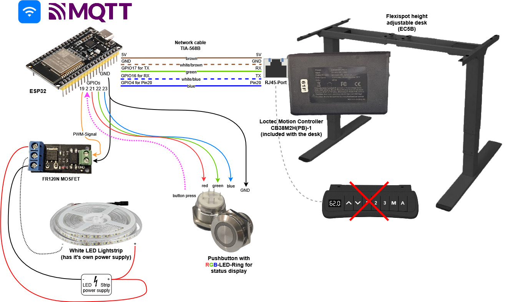

# FlexiBin

## What is FlexiBin?
A smart garbage bin enclosure based on a height-adjustable desk. Controlled locally via push-button or via MQTT with an ESP32.

## Why?
Because the 3 garbage cans in our front garden had been an eyesore for many years and we now wanted a nice enclosure/covering for them. Last year the time had finally come.
Of course, there are already countless off-the-shelf solutions available for this problem, but none of them are smart. So I thought: "Hey, why not completely over engineer a new solution for that problem?" :wink:

## How it's done?
I don't want to go into detail here about the construction of the wooden parts, because every situation on site is different and you have to build your own individual box anyway. Just this much: the desk frame is mounted on a raised wooden frame inside the box so that the maximum travel distance of 65 cm can be fully utilized. I use the EC5B frame from Flexispot, most (all?) Flexispot frames use Loctek Motion controllers so other models should also work, but of course I cannot guarantee this. The advantage of the Loctek Motion controllers is that the communication protocol has fortunately already been reverse engineered:
A big thank you to https://github.com/iMicknl/LoctekMotion_IoT!

Beside the desk frame I used the following parts:
- ESP32 microcontroller
- old network cable
- Push button with RGB-LED ring, 19mm, 3-6V (https://de.aliexpress.com/item/1005003538108177.html)
- FR120N MOSFET (https://www.amazon.de/dp/B07HBQZ9BK)
- LED-Strip (I used a 24V variant, but 12V will also work)
- a suitable power supply for the LED-Strip

The following picture shows how all components are wired together:

